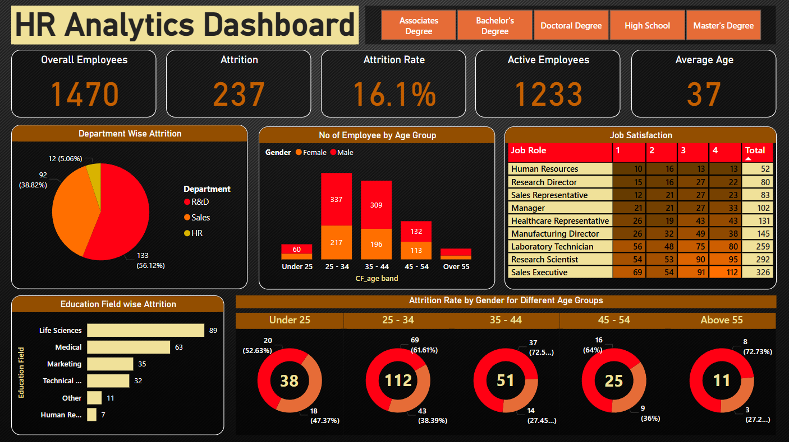

# HR Analytics Dashboard
In this project, I analyzed a dummy HR dataset designed to reflect real-world HR scenarios. Using Microsoft Power BI, I created an interactive dashboard to visualize key insights such as attrition rate, department-wise turnover, employee age and gender distribution, education field attrition, and job satisfaction levels. This helps in understanding employees trends and supports data-driven HR decisions.

## 📌 Dataset
- **Source:** [dummy HR dataset](https://docs.google.com/spreadsheets/d/1kT5Z6N2jK3ABOsay33OhD18PhaHRaOyM/edit?usp=sharing&ouid=117806829244204349758&rtpof=true&sd=true)
- **Description:** This dataset contains employee-related information, including total headcount, attrition data, age distribution, gender, job satisfaction, job roles, and educational background. It is used to analyze workforce dynamics and provide insights into organizational health.

## 🧰 Tools
- **Power BI**: Used to create visual reports and build interactive dashboards
- **Power Query**: Helps in shaping and preparing the data before analysis
- **DAX**: Used for defining custom calculations and deriving insights through measures and formulas
- **Excel**: Serves as the initial platform for storing and organizing raw data

## 📊 Key Metrics & Visuals

- **Total Employees**  
- **Attrition & Active Employees**  
- **Attrition Rate**  
- **Average Age**  
- **Department-Wise Attrition**  
- **Employees by Age Group & Gender**  
- **Job Satisfaction**  
- **Education Field Attrition**  
- **Gender-wise Attrition by Age Group**

## 📈 Dashboard Preview

> 📁 Open the `.pbix` file in Power BI Desktop to explore the interactive dashboard

## 📖 How to Use

1. Clone this repository or download the `.pbix` file
2. Open it using **Power BI Desktop**
3. Connect it to your dataset or modify queries/measures to suit your organization
